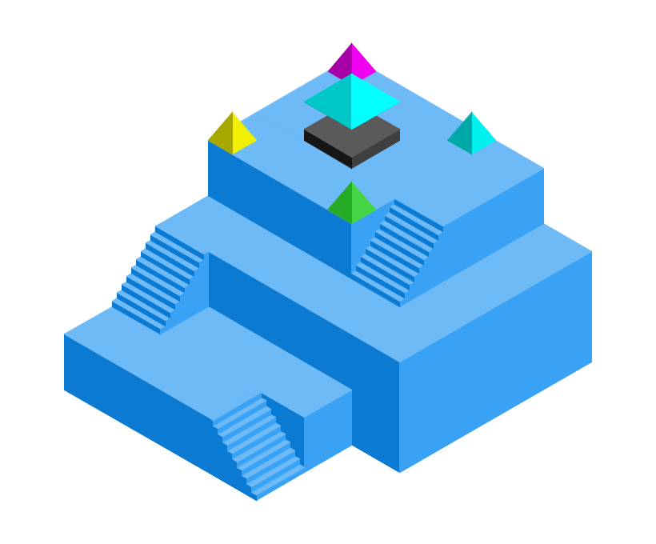
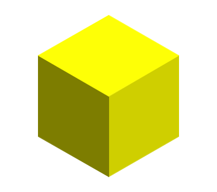
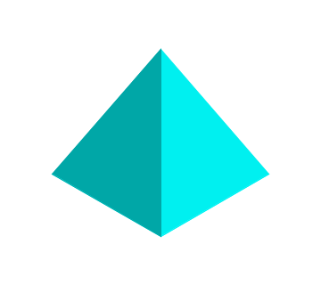
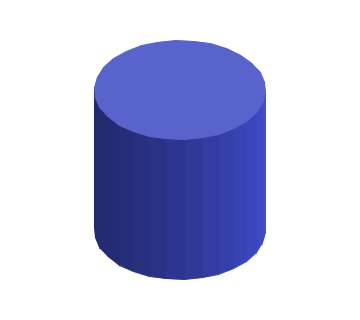
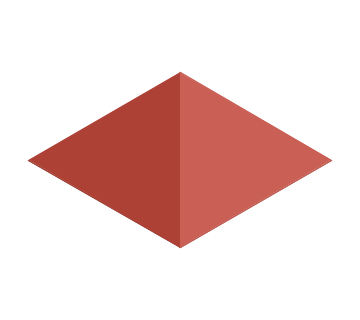
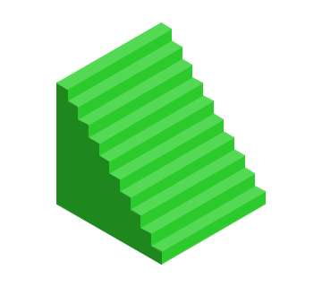
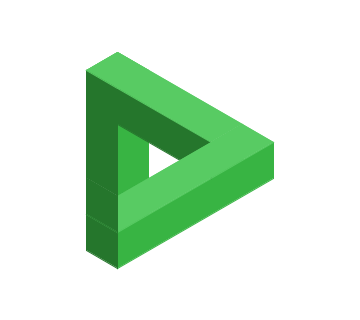

# Isometric

Declarative isometric rendering for Jetpack Compose.

[](LICENSE)
[](https://kotlinlang.org)
[](https://developer.android.com/about/versions/nougat)



## What is Isometric?

Isometric is a Kotlin library for rendering interactive isometric (2.5D) scenes in Jetpack Compose. Build scenes declaratively with `Shape`, `Group`, and `Path` composables. Transforms accumulate through the hierarchy, animations recompose only changed nodes, and built-in gesture handling supports tap and drag interactions with spatial hit testing.

## Features

- **Declarative scene graph** — `Shape`, `Group`, `Path`, `Batch`, `If`, `ForEach` composables
- **Hierarchical transforms** — position, rotation, and scale accumulate through groups
- **Per-node dirty tracking** — only changed subtrees re-render
- **Built-in animation** — vsync-aligned via `withFrameNanos`
- **Gesture handling** — tap and drag with spatial-indexed hit testing
- **Per-node interactions** — `alpha`, `onClick`, `onLongClick`, `testTag`, and caller-supplied `nodeId` props on every renderable composable
- **Tile grid** — `TileGrid` composable for isometric tile maps with automatic tap-to-tile routing
- **Stack layout** — `Stack` composable for 1D arrangement along any world axis (X, Y, or Z)
- **Camera control** — pan and zoom with `CameraState`
- **6 built-in shapes** — Prism, Pyramid, Cylinder, Octahedron, Stairs, Knot
- **Custom shapes** — extrude paths or implement `CustomNode` for full control

## Quick Start

### Installation

```kotlin
dependencies {
    implementation("io.github.jayteealao:isometric-compose:1.1.0")
}
```

### Your First Scene

```kotlin
@Composable
fun MyIsometricScene() {
    IsometricScene {
        Shape(geometry = Prism(position = Point(0.0, 0.0, 0.0)))
    }
}
```

The shape uses the scene default color. Pass `color = IsoColor(r, g, b)` when you want an explicit override.

See the [Quick Start guide](docs/getting-started/quickstart.md) for a complete walkthrough.

## Documentation

- [**Quick Start**](docs/getting-started/quickstart.md) — Build your first scene in 5 minutes
- [**Coordinate System**](docs/getting-started/coordinate-system.md) — How 3D world space maps to 2D screen space
- [**Shapes Guide**](docs/guides/shapes.md) — Built-in shapes, transforms, and custom geometry
- [**Animation**](docs/guides/animation.md) — vsync-aligned animation with `withFrameNanos`
- [**Gestures**](docs/guides/gestures.md) — Tap and drag with spatial hit testing
- [**Per-Node Interactions**](docs/guides/interactions.md) — Per-node `alpha`, `onClick`, `onLongClick`, `testTag`, and `nodeId`
- [**Tile Grid**](docs/guides/tile-grid.md) — Render and interact with isometric tile grids
- [**Stack**](docs/guides/stack.md) — Arrange shapes along a world axis
- [**Camera**](docs/guides/camera.md) — Pan and zoom with `CameraState`
- [**Theming & Colors**](docs/guides/theming.md) — `IsoColor`, palettes, lighting, stroke styles
- [**Custom Shapes**](docs/guides/custom-shapes.md) — `Path`, `Shape.extrude`, and `CustomNode`
- [**Performance**](docs/guides/performance.md) — Caching, native canvas, spatial indexing
- [**Compose Interop**](docs/guides/compose-interop.md) — Layout, state sharing, Material theming, navigation
- [**Advanced Configuration**](docs/guides/advanced-config.md) — Lifecycle hooks, custom engines, escape hatches
- [**Scene Graph**](docs/concepts/scene-graph.md) — Architecture, node types, and dirty tracking
- [**Depth Sorting**](docs/concepts/depth-sorting.md) — How isometric draw order works
- [**Rendering Pipeline**](docs/concepts/rendering-pipeline.md) — From recomposition to pixels
- [**Migration Guide**](docs/migration/view-to-compose.md) — Migrating from the View API to Compose

## Requirements

| Requirement | Version |
|-------------|---------|
| Android min SDK | 24 |
| Kotlin | 1.9+ |
| Jetpack Compose | 1.5+ |
| JVM target | 11 |

## Modules

| Module | Description |
|--------|-------------|
| `isometric-core` | Platform-agnostic rendering engine (pure Kotlin/JVM) |
| `isometric-compose` | Jetpack Compose integration (`IsometricScene`) |
| `isometric-android-view` | Traditional Android View support (`IsometricView`) |

## Available Shapes

| Prism | Pyramid | Cylinder | Octahedron | Stairs | Knot |
|:-----:|:-------:|:--------:|:----------:|:------:|:----:|
|  |  |  |  |  |  |

## Credits

Originally created by [Fabian Terhorst](https://github.com/FabianTerhorst). Rewritten in Kotlin with Compose Runtime API by [jayteealao](https://github.com/jayteealao).

## License

[Apache License 2.0](LICENSE)
